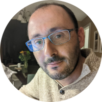
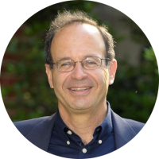
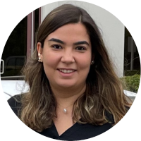

# External Expert Advisory Board

The following board of experts provide a valuable outside opinion on the progress and objectives of the BioPIM project.

## [Jared Simpson](https://oicr.on.ca/researchers/jared-simpson/)

 

Ontario Institute for Cancer Research

The Simpson lab develops algorithms and software for the analysis of high-throughput sequencing data. The lab, led by Dr. Jared Simpson, works primarily on de novo genome assembly, the detection of somatic mutations in cancer and, most recently, the development of algorithms for nanopore-based sequencers.

 

## [Paul Medvedev](https://medvedevgroup.com/)

Pennsylvania State University

Paul Medvedev is an Associate Professor in the Department of Computer Science and Engineering and the Department of Biochemistry and Molecular Biology and the Director of the Center for Computational Biology and Bioinformatics at the Pennsylvania State University. His research focus is on developing computer science techniques for analysis of biological data and on answering fundamental biological questions using such methods.

 

## [Uzi Vishkin](http://users.umiacs.umd.edu/~vishkin/index.shtml)

University of Maryland

Uzi Vishkin's research aspirations evolved over the years from that of a parallel algorithms theory specialist to more of a generalist. The deep question guiding his work has been whether it is feasible to align the theory of parallel algorithms, parallel programming and many-core hardware into a coherent computing stack for the processor of the future. Along with his research team, he developed the only current approach that enables that, while vendor-supported approaches have given up on their prior objective.

 

## [Damla Şenol Çalı](https://damlasenolcali.github.io/)

Bionano Genomics

Damla Çenol Çalı is a Staff Software Engineer, Hardware Acceleration at Bionano Genomics. Her research focuses on hardware/software co-design for accelerating bioinformatics applications and genomic data analysis. I am also excited about memory systems and processing-in-memory. During her Ph.D., Damla also interned at Intel Labs in 2018 and 2020. 

 
