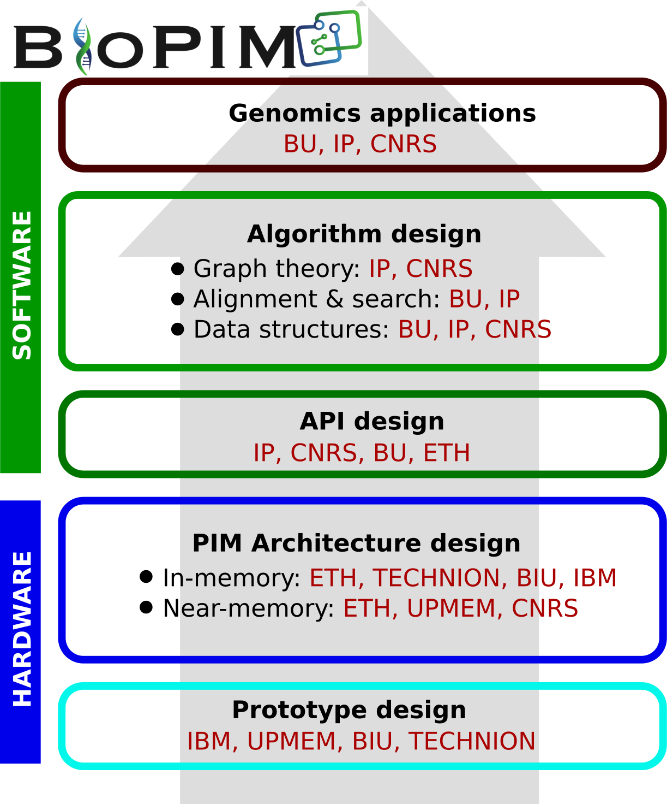

**BioPIM** consists of five academic institutions and two companies from four European countries, Turkey, Switzerland, France, and Israel. The partners have complementary expertise within the disciplines of computer science, computer engineering, electrical engineering and genomics allowing an interdisciplinary approach for achieving **BioPIM**'s goals. 

Engagement of partners from different but complementary backgrounds will brighten up breakthrough features of **BioPIM** and ensure attainment of the strategic objectives of the consortium. **Objective 1**, which includes optimizing algorithms and data structures for PIM will take guidance from **Bilkent**, **Pasteur**, and **CNRS**. We will use several software tools to profile computational behavior, some of which were developed by **ETH Zurich** and **IBM Research Zürich**. **Objective 2**, which involves hardware/software co-development requires expertise by all participants, where algorithmic aspects will be guided by **Bilkent**, **Pasteur**, and **CNRS**, and hardware development will be guided by **ETH Zurich**, **TECHNION**, **Bar-Ilan**, **IBM**, and **UPMEM**. **Objective 3**, which involves PIM architecture prototyping and API design requires expertise in simulation infrastructures that **ETH Zurich**, **IBM**, and **UPMEM** have, and API development that **Pasteur** will lead with the participation of **Bilkent**, **ETH Zurich**, **IBM**, **Bar-Ilan**, and **TECHNION**.

# Project Coordinator

**[Can Alkan](http://cs.bilkent.edu.tr/%7Ecalkan)** is an Associate Professor in [Computer Engineering](http://cs.bilkent.edu.tr/) at [Bilkent University](https://w3.bilkent.edu.tr/bilkent/). He has over 20 years of experience in algorithm design for bioinformatics and he has contributed to several large-scale genome sequencing efforts such as the [1000 Genomes Project](https://www.internationalgenome.org/) and [Genome in a Bottle](https://www.nist.gov/programs-projects/genome-bottle).

**Team members:** [Gamze Kozanoğlu](https://www.linkedin.com/in/gamze-kozanoglu-8879a14/), [Pınar Demirekler Burat](https://www.linkedin.com/in/pinar-demirekler-burat-5b23054/), [Klea Zambaku](https://www.linkedin.com/in/klea-zambaku-88992b199/), [Ecem İlgün](https://www.linkedin.com/in/ecemilgun/), [Ömer Yavuz Öztürk](https://www.linkedin.com/in/o-yavuz-ozturk/)

# Team Leaders

**[Onur Mutlu](http://people.inf.ethz.ch/omutlu/)** is a Professor of Computer Science at [ETH Zürich](https://ethz.ch/en.html), in the [Information Technology and Electrical Engineering](https://www.ee.ethz.ch/) department. He is an expert in computer architecture, systems, security, and bioinformatics.

**Team members:** [Juan Gómez Luna](https://www.linkedin.com/in/juan-gomez-luna-428b3b12/), [Mohammed Alser](https://www.linkedin.com/in/mealser/), [Joël Lindegger](https://www.linkedin.com/in/joël-lindegger-5b004b168/), [Nika Mansouri Ghiasi](https://www.linkedin.com/in/nika-mansouri-ghiasi-4b521ba2/), [Can Firtina](https://cfirtina.com), [Banu Cavlak](https://www.linkedin.com/in/banu-cavlak-0003b5180/?lipi=urn%3Ali%3Apage%3Ad_flagship3_groups_manage%3Bn12dJnFjSJyZwpIC%2BQ37YQ%3D%3D), [Tracy Ewen](https://www.linkedin.com/in/tracy-ewen/)

---

**[Rayan Chikhi](http://rayan.chikhi.name/)** is a researcher in bioinformatics and group leader of [Sequence Bioinformatics](https://research.pasteur.fr/en/team/sequence-bioinformatics/) at [Institut Pasteur](https://www.pasteur.fr/en). His interests range from fundamental data structures and algorithms, to their implementation and execution in the context of DNA and RNA sequencing and de novo genome assembly.

**Team members:** Erwan Drezen, [Yoann Dufresne](https://research.pasteur.fr/en/member/yoann-dufresne/), [Yoshihiro Shibuya](https://www.linkedin.com/in/yoshihiro-shibuya)
---

**[Dominique Lavenier](https://lavenier.net/homepage/)** is a [CNRS](https://www.cnrs.fr/en) Research Director and the [GenScale](https://team.inria.fr/genscale/) team leader at [IRISA](https://www.irisa.fr/english/)/[INRIA](https://www.inria.fr/en). His main research interests are bioinformatics, genomics, parallelism, computer design and optimization.

**Team members:** [Meven Mognol](https://www.linkedin.com/in/meven-mognol-292935b8/)

---

**[Abu Sebastian](https://researcher.watson.ibm.com/researcher/view.php?person=zurich-ASE)** is a Distinguished Research Staff Member & Manager at [IBM Research Zürich](https://www.zurich.ibm.com/). He was a contributor to several key projects in the space of storage and memory technologies and currently manages the research effort on in-memory computing at IBM Research Zurich.

**Team members:** [İrem Boybat](https://www.linkedin.com/in/irem-boybat/), [William Simon](https://www.linkedin.com/in/williamsimon1/)

---

**[Ran Ginosar](https://webee.technion.ac.il/%7Eran/)** is a Professor of [Electrical Engineering](https://ece.technion.ac.il/) at [Technion - Israel Institute of Technology](https://www.technion.ac.il/en/). He is an expert in many-core plural architectures, VLSI, neurochips, and asynchronous logic design.

**Team members:** Naomie Abecassis 

&nbsp;

&nbsp;

---

**[Yann Falevoz](https://www.linkedin.com/in/yannfalevoz/)** is Product Manager & Tech Marketing Project Manager at [UPMEM](https://www.upmem.com/). 

**Team members:** [Aphélie Moisson-Franckhauser](https://www.linkedin.com/in/a-moisson/), [Meven Mognol](https://www.linkedin.com/in/meven-mognol-292935b8/)

---

**[Leonid Yavits](https://engineering.biu.ac.il/en/node/11126)** is a Senior Lecturer at [Bar-Ilan University](https://www.biu.ac.il/en). He was formerly the founder of VisionTech and HorizonSemi, and he served as the Engineering Director at Broadcom Israel. Dr. Yavits is an expert in domain and application specific accelerators, especially using associative processors.

**Team members:** [Zuher Jahshan](https://www.linkedin.com/in/zuher-jahshan-7a7199196/)

