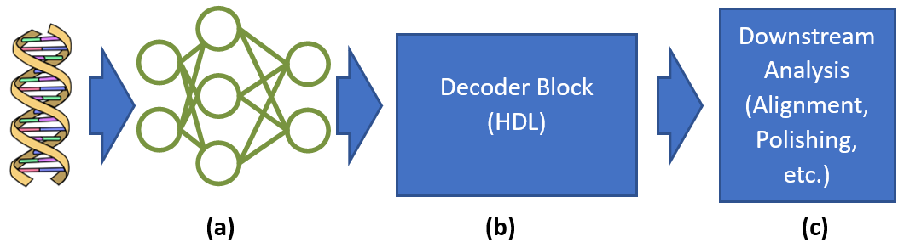

## Bilkent University

Alkan Lab for Bioinformatics and Computational Genomics at Bilkent University, Turkey, is looking for **outstanding, self-motivated graduate students (both M.Sc. and Ph.D.) and postdoctoral fellows** to join our project as early as May 1, 2022., which is recently funded by the Horizon Europe program. Our project, “Processing-in-memory architectures and programming libraries for bioinformatics algorithms (BioPIM)”, aims to accelerate bioinformatics analyses using modern processing-in-memory (PIM) hardware technologies. Together with our partners from ETH Zurich, IBM, Institut Pasteur, UPMEM, CNRS, and TECHNION, we will focus on co-designing algorithms and data structures commonly used in bioinformatics together with emerging PIM hardware technologies to obtain the highest benefit in terms of cost, energy efficiency, and time savings in genome sequence analysis. 

Specific topics within this project will involve rigorous profiling, benchmarking, and workload analysis of existing bioinformatics tools to better optimize hardware/software mapping; developing and optimizing data structures and bioinformatics algorithms to work more efficiently on various types of PIM devices; hardware/software co-design for PIM; and PIM-friendly application programming interface (API) design. 

More details can be found on our project page: [http://www.biopim.eu](http://www.biopim.eu). 

**Requirements:**
* B.Sc. degree (for M.Sc. students); or M.Sc. degree (for Ph.D. students), or Ph.D. degree (for postdoctoral fellows) in **computer science, computer engineering, or electrical engineering**.
* Expertise in developing efficient data structures and combinatorial algorithms (dynamic programming, greedy algorithms, approximation algorithms, graph theory) is a **must**.
* Strong skills in C/C++ is a **must**.
* Basic understanding of biology/genetics/genomics is a plus.
* Proficiency in hardware description languages (Verilog, VHDL) is a plus.
* [Requirements for application to graduate level study at Bilkent University](http://mfbe.bilkent.edu.tr/?page_id=17) must be fulfilled.

Successful candidates will receive a full tuition waiver (for M.Sc. and Ph.D. students), competitive monthly stipend, health insurance, free accommodation, and transportation. 

Interested applicants should email their CV and transcripts (graduate student applications) to [biopim [at] bilkent [dot] edu [dot] tr](mailto:biopim@bilkent.edu.tr)

## IBM

**Genome sequencing**, the process of determining the DNA sequence of an organism's genome, can be used to study the genetic basis of various diseases and traits, to understand evolutionary relationships between organisms, and to develop new treatments and therapies. It has become increasingly accessible and affordable in recent years, enabling scientists and researchers to analyze large amounts of genetic data and make new discoveries about the genetic underpinnings of life. 

At the core of the sequencing pipeline is the **basecalling** process, or converting sensed electrical signals into the string of bases. Current state-of-the-art algorithms use **deep neural networks** that account for **40-80% of the sequencing pipeline**, and require expensive GPUs to run, presenting a bottleneck in the sequencing pipeline.

To overcome this bottleneck, a new **in-memory computing device** has been proposed, which can perform basecalling in realtime on the portable DNA sensing device, eliminating the need for a costly basecalling workstation and enabling sequencing in even more remote and off-the-grid scenarios. Alongside the device, a new DNN basecalling algorithm has been proposed, which maintains >90% inference accuracy.
Despite these advances, there are still many improvements to the proposed HW/SW system that can be achieved. This project will focus on one of the following three topics:
* **Exploring DNN implementations** that take advantage of the in-memory computing device’s unique and special capabilities to improve accuracy while maintaining a small area and power footprint (Fig.1-a).
* **Developing new decoding hardware in HDL** for converting the output of the DNN, which represents probabilities that the DNA strand contains a base at a given timestep, into the actual inferred base string  (Fig.1-b).
* **Developing downstream analysis algorithms** that run on the in-memory computing device after basecalling to extend the utility of the device beyond basecalling  (Fig.1-c). 

We are looking for enthusiastic PhD students interested in applying new in-memory computing paradigms to bioinformatics to enable genome sequencing in off-grid environments. This will be a 6 month exchange/internship taking place at IBM's Zürich campus.

**Requirements**
* Outstanding programming skills (Python/C++ for Project 1/3, also HDL for Project 2)
* Understanding of CNN/LSTM DNNs.
* Independent learning/working abilities
* Interest in bioinformatics
* Strong work ethic

**Figure 1:** Basecalling pipeline with DNN (a), decoder block (b), and downstream analysis (c).

**For background and past works, see:**

* Nanopore Basecalling
    * [Nanopore website explanation](https://nanoporetech.com/how-it-works/basecalling)
*	In-memory computing
    * [Helix: SW/HW Co-design for Accelerating Nanopore Genome Base-calling](https://arxiv.org/abs/2008.03107)
    * [A Heterogeneous and Programmable Compute-In-Memory Accelerator Architecture for Analog-AI Using Dense 2-D Mesh](https://ieeexplore.ieee.org/document/9957094)
* Decoding algorithms
    * [CTC decoding](https://towardsdatascience.com/intuitively-understanding-connectionist-temporal-classification-3797e43a86c)
    * CRF decoding [Pt1](https://lauraruis.github.io/2021/01/25/crfpt1.html), [Pt2](https://lauraruis.github.io/2021/01/25/crfpt2.html)

Interested applicants should email their CV and transcripts to [william.simon1 [at] ibm [dot] com](mailto:william.simon1@ibm.com).
