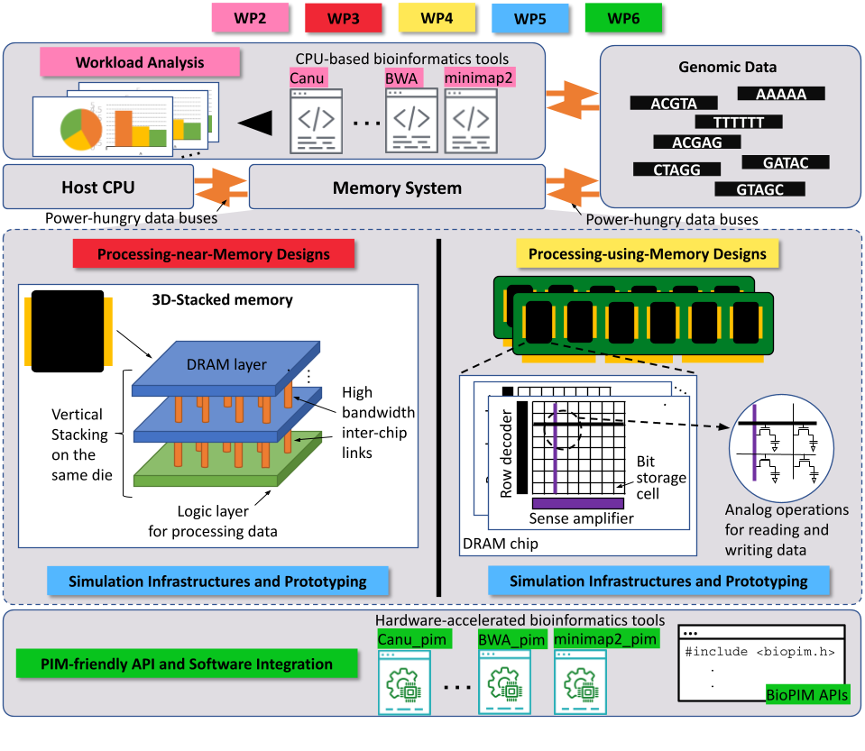

The strategy proposed to achieve the goals of the BioPIM project is based on the completion of 7 work packages (WPs), in 48 months, by 7 partners. The figure below summarizes the aims of the BioPIM WPs.

    

* **Work Package 1** will ensure that the project is managed soundly in terms of its administrative, financial and technical progress.
* **Work Package 2** will analyze computational bottlenecks of commonly used bioinformatics/genomics algorithms and popular tools in the field, and execution time  they   spend on different components of the computer. Therefore, WP2 will guide the hardware and algorithm designs, APIs, and software integration that we will  develop in  the remainder of the work packages.
* **Work Package 3** will focus on designing near-memory logic layers to accelerate algorithms that we will select and characterize in WP2.
* **Work Package 4** will take an alternate approach of PIM acceleration, where we will co-develop hardware/software to perform computation directly on the memory  device. We note that it is also possible to develop PIM acceleration using both strategies that we will pursue in WP3 and WP4. Therefore, the activities within these  two work packages will be carried out in sync.
* **Work Package 5** will develop simulation, emulation, and prototyping strategies (using both CPUs and FPGAs) to test the efficiency and correctness of our PIM  designs.
* **Work Package 6** will focus on practical aspects of this project for external users where we will develop application programming interfaces and software to enable  other researchers to take full advantage of our PIM designs.
* **Work Package 7** is dedicated to dissemination and communication activities as well as monitoring the innovation aspects and market potential.